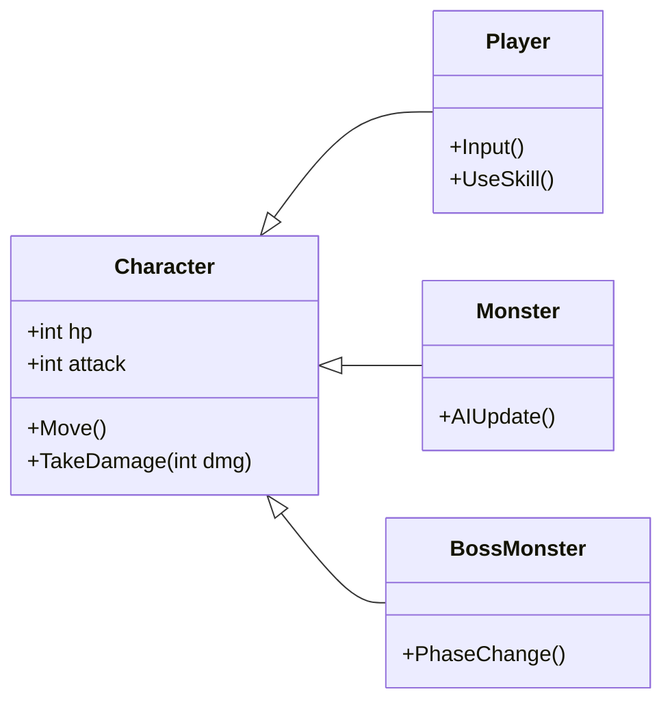

## [ Sample 클래스 다이어그램 (Mermaid UML) ]

현재 내가 사용하는 github 블로그 테마는 **Minimal-Mistakes** 기반이라 포스팅 파일 형식이 마크다운 형식이다.

해당 형식의 마크다운 파일 내에서, UML 다이어그램을 지원하는 것을 확인하였고 샘플로 Mermaid UML 다이어그램을 임의로 만들어 보고 싶었다.
아래가 결과물이다. 

### 결과물

